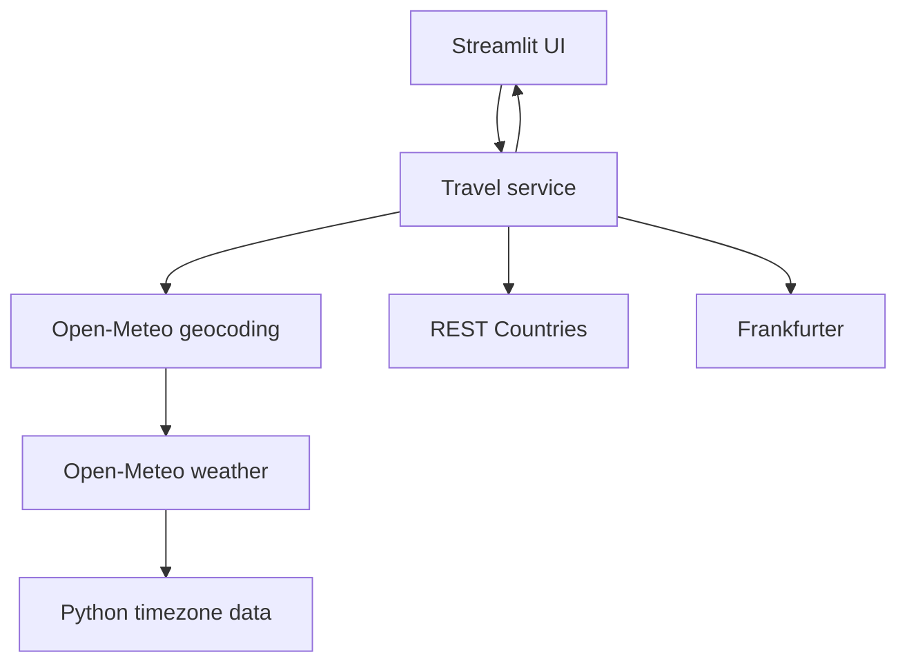

# TravelPulse

TravelPulse is a polished Streamlit dashboard that combines public APIs into a destination brief: current weather, country context, currency conversion, and local time.

## Features

- Destination geocoding with latitude and longitude
- Current temperature, humidity, wind, and readable weather conditions
- Country, capital, region, continent, population, currency, and flag
- Frankfurter exchange rate to USD when supported
- Timezone and local time derived from Open-Meteo data
- Friendly handling for empty input, no results, timeouts, HTTP failures, invalid JSON, and missing fields
- In-app API Basics learning section

## Technology and APIs

Python 3.11+, Streamlit, requests, python-dotenv, pytest, and Git are used. The app calls Open-Meteo Geocoding, Open-Meteo Weather, REST Countries, and Frankfurter. These providers do not require API keys for the current feature set.

## Architecture



The service layer owns API chaining and returns normalized data. API modules own provider-specific parsing. The UI only renders results and user-facing errors.

## Project structure

```text
app.py                 Streamlit entry point
api/                   Provider clients
services/              API orchestration
utils/                 HTTP helper and shared behavior
ui/                    Styles and dashboard components
tests/                 Mocked unit and integration tests
.streamlit/config.toml Streamlit theme and server settings
```

## Run locally

PowerShell on Windows:

```powershell
python -m venv .venv
.\.venv\Scripts\Activate.ps1
python -m pip install -r requirements.txt
Copy-Item .env.example .env
streamlit run app.py
```

Python 3.11 or newer is supported. The current development environment uses Python 3.14.

## Test

```powershell
.\.venv\Scripts\python.exe -m pytest -q
```

Tests mock HTTP boundaries, so they do not depend on network availability. The app itself checks status codes, timeouts, connection failures, JSON decoding, and optional fields.

## Environment variables and security

`.env.example` documents the optional configuration surface. `.env` and Streamlit secrets are ignored by Git. No API key is required today; any future credential must be supplied through environment variables or Streamlit Cloud secrets.

## Git workflow

Each completed development stage has its own meaningful commit. Review the history with:

```powershell
git log --oneline
```

## GitHub

Create an empty repository on GitHub, then connect and push it:

```powershell
git remote add origin https://github.com/YOUR-USER/YOUR-REPOSITORY.git
git branch -M main
git push -u origin main
git remote -v
git status
```

Replace the placeholder URL with your actual repository URL. This project does not claim a remote has been configured.

## Streamlit Community Cloud

1. Open Streamlit Community Cloud and sign in with GitHub.
2. Select the repository and branch.
3. Set the app entry point to `app.py`.
4. Add any future credentials under App settings and Secrets.
5. Deploy and test a valid city, an unknown city, and an empty search.

## Future enhancements

Forecast charts, saved destinations, map visualization, unit preferences, and optional image search would be natural next steps.
