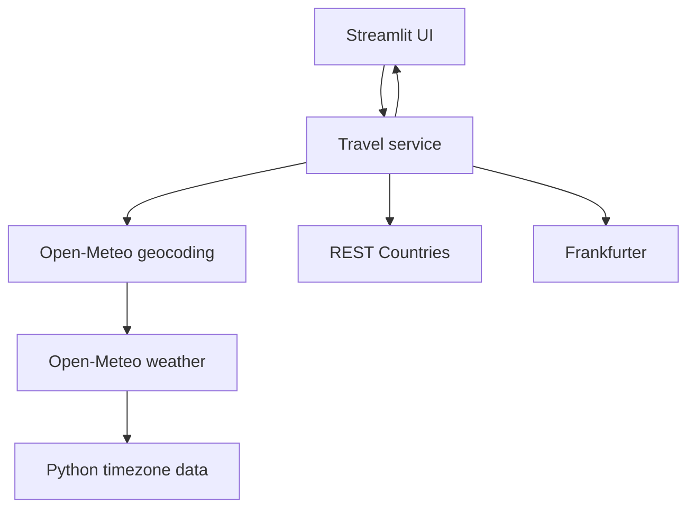

# TravelPulse

TravelPulse is a polished Streamlit dashboard that combines public APIs into a destination brief: current weather, country context, currency conversion, and local time.

**Live app:** [Open TravelPulse](https://travelpulse-kyxeasnfj6q2gwc33hyjhd.streamlit.app/)

## Features

- Destination geocoding with latitude and longitude
- Current temperature, humidity, wind, and readable weather conditions
- Country, capital, region, continent, population, currency, and flag
- Frankfurter exchange rate to USD when supported
- Timezone and local time derived from Open-Meteo data
- Friendly handling for empty input, no results, timeouts, HTTP failures, invalid JSON, and missing fields
- In-app API Basics learning section

## Technology and APIs

Python 3.11+, Streamlit, requests, python-dotenv, pytest, and Git are used. The app calls Open-Meteo Geocoding, Open-Meteo Weather, REST Countries, and Frankfurter. These providers do not require API keys for the current feature set.

## Architecture



The service layer owns API chaining and returns normalized data. API modules own provider-specific parsing. The UI only renders results and user-facing errors.

## Project structure

```text
app.py                 Streamlit entry point
api/                   Provider clients
services/              API orchestration
utils/                 HTTP helper and shared behavior
ui/                    Styles and dashboard components
tests/                 Mocked unit and integration tests
.streamlit/config.toml Streamlit theme and server settings
```

## Future enhancements

Forecast charts, saved destinations, map visualization, unit preferences, and optional image search would be natural next steps.

## Final verification

- Application modules compile successfully on Python 3.14.
- Streamlit startup smoke test returned HTTP 200.
- Live Paris chain returned Paris, France, current weather, and Europe/Paris local time.
- Automated suite passes: 14 tests.
- `.env` and `.venv` are ignored by Git; no secrets are committed.
